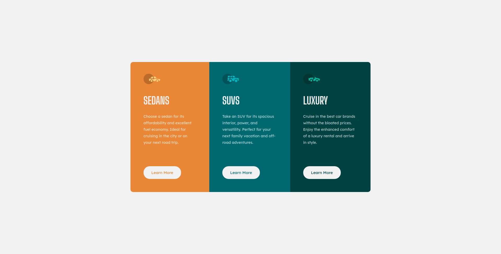

# Frontend Mentor - 3-column preview card component solution

This is a solution to the [3-column preview card component challenge on Frontend Mentor](https://www.frontendmentor.io/challenges/3column-preview-card-component-pH92eAR2-). Frontend Mentor challenges help you improve your coding skills by building realistic projects. 

## Table of contents

- [Overview](#overview)
  - [The challenge](#the-challenge)
  - [Screenshot](#screenshot)
  - [Links](#links)
- [My process](#my-process)
  - [Built with](#built-with)
  - [What I learned](#what-i-learned)
  - [Continued development](#continued-development)
- [Author](#author)
- [Acknowledgments](#acknowledgments)

## Overview

### The challenge

Users should be able to:

- View the optimal layout depending on their device's screen size
- See hover states for interactive elements

### Screenshot

### Links

- Solution URL: [Solution](https://www.frontendmentor.io/solutions/i-love-strawberries-7Mwio0gSz)
- Live Site URL: [Live](https://epic-euclid-d0d75f.netlify.app/)

## My process

### Built with

- Semantic HTML5 markup
- SCSS
- Flexbox
- Mobile-first workflow
- [Vue.js](https://vuejs.org/)

### What I learned

Mastering Vue <3

### Continued development

I want to complete these challenges using vue :)

## Author

- Github - [Mikołaj Szymczuk](https://github.com/mikolajszymczuk1)
- Frontend Mentor - [@mikolajszymczuk1](https://www.frontendmentor.io/profile/mikolajszymczuk1)

## Acknowledgments

LOVE VUE <3